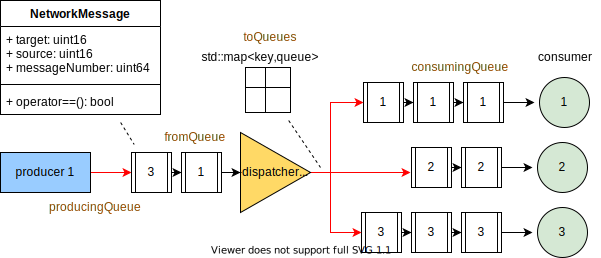

# **Concurrent Server**

## **Problem description.**

The objective of the project is to develop a concurrent and distributed web server that allows a specified number of clients to obtain the Goldbach sums of numbers in an efficient. Most of the web servers implement some kind of concurrency to serve multiple clients in real time and satisfy all of the service demands. Particularly, the producer-consumer pattern results pretty useful to divide the responsibilities of each thread, simulating a coordinated work team that accomplish a task (that would be pretty complicated if it was done just by one worker). This workers are only able to communicate with each other by a buffer (container of the products). This buffer allow them to take a work unit from it and process it to pass it to he next workers until the task is completed. This image could help understanding the producer-consumer pattern: 



It is extremely important to develop skills to work with third party code of inherited code. Nowdays enterprises are most likely to provide its staff code that has already been created for them to modify it. Most of this code was inherited from Jeisson Hidalgo Cespedes (see [Third party code and bibliography](#third-party-code-and-bibliography)).

At this stage of the project, support was implemented for different applications that may be developed in the future, being manipulated by an identifying "key" and its operation would act normally. Also, the web applications should have a role in the producer-consumer pattern. This is not exclusive for one thread. Many threads are created with different roles in the production of the client response. Some threads will do some arithmethic functions, others will assemble the HTML response for the client, other will analize the clients request, etc. This is normal in the web servers, because it increments the efficiency in the response by distributing the work between a lot of workers with different roles.

The web application finds all the golbach sums for the numbers that the user wants. This concern is born from a historical conjecture that to nowadays has not been demonstrated yet. In 1742 Christian Goldbach proposed a weak and a strong conjecture to the mathematician Leonhard Euler. According to Goldbach, the conjecture is true for any number greater than five. The strong conjecture is that any even number can be written as the sum of two prime numbers. The weak one suggests that any odd number can be written as the sum of three prime numbers.

For this specific problem, a goldbach web app was created. The threads contained have different roles in the production. The first one is an url analizer, that extracts the request or the client. The i is sent to some goldbach solvers, that calculate the sums of one particular number and sends those sums to the next thread. These solvers are set by default to the maximun amount of CPUs avalizable in the host machine. This sums are sent to a packer, that stores the sums received and forms a compact response with all the sums requested by one client. When this packages are ready they are sent to a body creator, in charge of creating an HTML format response with the sums of the numbers. Finally a sender receives this HTML response and sends it to the client.

The presented code has the following operation: when executed, the user will be asked to enter the number of numbers they want. It will calculate the amount of golbach sums that can be done to form these numbers. If the number entered is negative, in addition to the amount of golbach sums of the number, the console will display for the user the sums that can be made for that number. Of course, if the input is a number between zero and five (except if the number is four), the user will be shown that there are no golbach sums to form (NA), since the conjecture is only true for numbers greater than five. This is an example of the golbach conjecture:

```console
4: 1 sums: 2 + 2
8: 1 sums: 3 + 5
9: 2 sums: 2 + 2 + 5, 3 + 3 + 3
14: 2 sums: 3 + 11, 7 + 7
21: 5 sums: 2 + 2 + 17, 3 + 5 + 13, 3 + 7 + 11, 5 + 5 + 11, 7 + 7 + 7
```

## **User's manual**

---

### **Compilation**

The program provides a Makefile that facilitates terminal compilation via command line.
* To compile and generate the executable, type in the terminal the command **make**
* To delete the files generated by the makefile, type in the terminal the command **make clean**

---

### **Execution**

The executable file is saved in the **bin** folder with the name **Proyecto_1**. Therefore to run the program type in the terminal the command:
```console
bin/Proyecto_1
```

The execution allows the user to indicate as the first argument the port number on which the web server will wait for connections from clients as second argument the number of threads he wants to work with. In this case run the program typing in the terminal the command:

```console
bin/Proyecto_1 Port_Number Max_Connections
```

To stop the execution of the program type in the terminal **Ctrl+C** or the command **kill**.

When the web server is running in the **localhost:Port_Number** user can put numbers in the respective space. User can place a number positive or negative, and also can put several numbers, to do this you need to put the numbers separated by a comma and without spaces in between.

---

### **Running sanitizers**  

To check for memory leaks, invalid access, among other things, this can be done as follows:  

**asan:** run in the terminal the command **make clean** then **make asan** and run the generated executable file **bin/Proyecto_1**

**msan:** run in the terminal the command **make clean** then **make msan** and run the generated executable file **bin/Proyecto_1**

**ubsan:** ejecute en la terminal el comando **make clean** then **make ubsan** and run the generated executable file **bin/Proyecto_1**

**tsan:** ejecute en la terminal el comando **make clean** then **make asan** and run the generated executable file **bin/Proyecto_1**

**memcheck:** run in the terminal the command **make memcheck**

**helgrind:** run in the terminal the command **make helgrind**

**linter:** run in the terminal the command **make lint**

---

## **Http Server performance**

Running the following command in the terminal while executing the server, the show results were:

```console
httperf --server localhost --port 8080 --uri /gold?number=777 --num-conns 200 --rate 50 --num-call 10 --timeout 5

buffer=16384 --num-conns=200 --num-calls=10
Maximum connect burst length: 2

Total: connections 200 requests 2000 replies 2000 test-duration 5.713 s

Connection rate: 35.0 conn/s (28.6 ms/conn, <=66 concurrent connections)
Connection time [ms]: min 71.5 avg 953.4 max 1773.0 median 995.5 stddev 539.9
Connection time [ms]: connect 0.3
Connection length [replies/conn]: 10.000

Request rate: 350.1 req/s (2.9 ms/req)
Request size [B]: 77.0

Reply rate [replies/s]: min 345.6 avg 345.6 max 345.6 stddev 0.0 (1 samples)
Reply time [ms]: response 95.3 transfer 0.0
Reply size [B]: header 103.0 content 281.0 footer 0.0 (total 384.0)
Reply status: 1xx=0 2xx=2000 3xx=0 4xx=0 5xx=0

CPU time [s]: user 3.91 system 0.93 (user 68.5% system 16.2% total 84.7%)
Net I/O: 157.6 KB/s (1.3*10^6 bps)

Errors: total 0 client-timo 0 socket-timo 0 connrefused 0 connreset 0
Errors: fd-unavail 0 addrunavail 0 ftab-full 0 other 0
```

With 20 calls these were the results:

```console
httperf --server localhost --port 8080 --uri /gold?number=777 --num-conns 200 --rate 50 --num-call 20 --timeout 5
httperf --timeout=5 --client=0/1 --server=localhost --port=8080 --uri=/gold?number=777 --rate=50 --send-buffer=4096 --recv-buffer=16384 --num-conns=200 --num-calls=20
Maximum connect burst length: 2

Total: connections 200 requests 4000 replies 4000 test-duration 9.170 s

Connection rate: 21.8 conn/s (45.8 ms/conn, <=119 concurrent connections)
Connection time [ms]: min 208.9 avg 2869.7 max 5225.6 median 2850.5 stddev 1456.3
Connection time [ms]: connect 0.3
Connection length [replies/conn]: 20.000

Request rate: 436.2 req/s (2.3 ms/req)
Request size [B]: 77.0

Reply rate [replies/s]: min 430.0 avg 430.0 max 430.0 stddev 0.0 (1 samples)
Reply time [ms]: response 143.5 transfer 0.0
Reply size [B]: header 103.0 content 281.0 footer 0.0 (total 384.0)
Reply status: 1xx=0 2xx=4000 3xx=0 4xx=0 5xx=0

CPU time [s]: user 6.68 system 1.15 (user 72.9% system 12.6% total 85.5%)
Net I/O: 196.4 KB/s (1.6*10^6 bps)

Errors: total 0 client-timo 0 socket-timo 0 connrefused 0 connreset 0
Errors: fd-unavail 0 addrunavail 0 ftab-full 0 other 0
```

## **Third party code and bibliography**

- [Hidalgo, Jeisson. (2022). Concurrent and distributed web server](https://jeisson.ecci.ucr.ac.cr/concurrente/2021b/proyectos/webserv/)

---

## **Credits**

Copyrigth 2022.

Members:

  - Bayron Ramirez Jimenez <bayron.ramirezjimenez@ucr.ac.cr>
  - Yordi Robles Siles <yordi.robles@ucr.ac.cr>
  - Sebastian Rodriguez Tencio <sebastian.rodrigueztencio@ucr.ac.cr>
  - Enrique Vilchez Lizano <enrique.vilchezlizano@ucr.ac.cr>

Instructor: Alberto Rojas Salazar <alberto.rojassalazar@ucr.ac.cr>

Universidad de Costa Rica. CC BY 4.0
