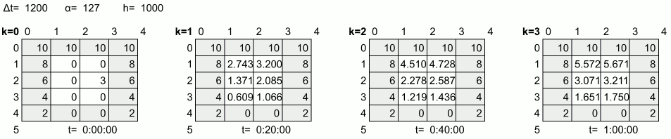
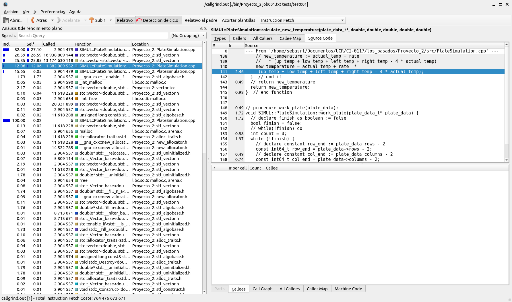
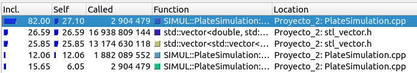
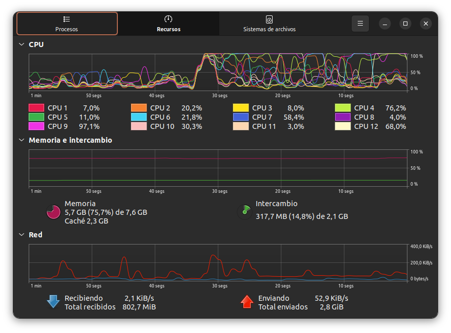
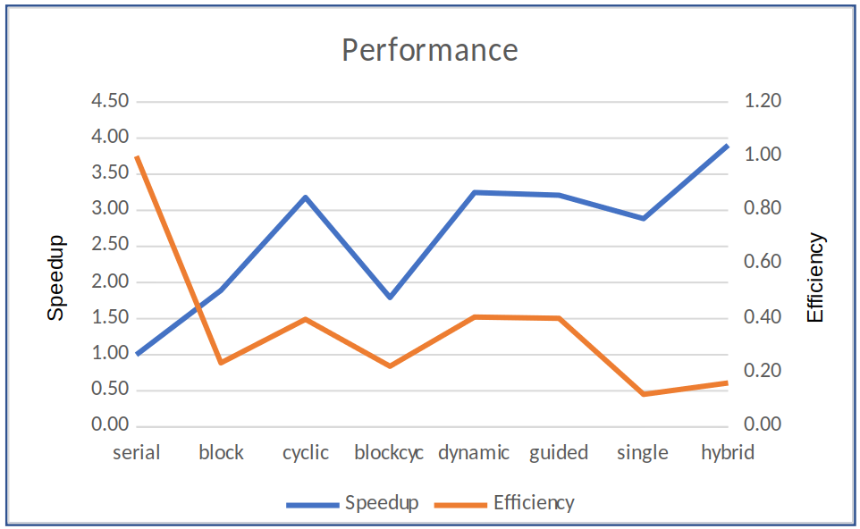

# <span style="color:#FC5656">**Heat Simulation**</span>

## <span style="color:#FCAE56">**Problem description**</span>

This program tries to simulate a transfer of heat to a plate of certain material. For some engineering, the expansion of heat on the surfaces is essential to determine which materials should be placed for certain architectural structures. If these tests were not done before implanting the materials, the consequences could be catastrophic. In addition, these simulations are great for the academic/scientific field. Suppose you want to determine the expansion of heat in a certain metal that you are going to use to weld very specific parts. If the correct type of metal is not used, the heat expansion could injure the person in charge of welding these pieces. This is a very basic example of the scientific utilities of a heat expansion simulation.

Also, although it is true that these tests could give more information if they were done physically, the costs that doing them can represent on many occasions is very high for certain work teams. Reducing these costs is one of the goals of virtual simulations. Most of the costs are monetary, but the time investment also comes into play for major projects. Normally, real world situations cannot be sped up easily, unlike programs running on modern computing machines. Processing speeds are increasing, and the number of optimizations that can be done to programs is almost infinite. Therefore, this kind of simulation saves a lot of work for certain teams that use measurements to advance their projects.

The heat simulation consists of showing different states of a sheet, which is specified by its thermal diffusion,
For the purpose of each simulation, the sheets are divided into different numbers of rows, columns and cells containing different sizes (dimensions).

In the zero state the simulation loads a matrix file indicating the initial temperatures of each cell in the sheet. A figure is shown below where it can be seen that in the upper part heat is injected at a constant temperature of 10 units (Celcius, Farenheit, or Kelvin), and as you go down the sheet, less heat is provided at the edges.



Note: The edges of the sheet do not change their temperature over time, since this is the point where the experimenters "inject or withdraw heat."

At each instant or state, the simulation should update the internal cells of the sheet according to the physical model presented above.
At state k=1 kΔt=1200s=20min will have elapsed. As can be seen in the previous image , the temperatures at the edges
remain constant, but the inner cells have acquired energy from the edges, especially the cells at the top. However, cell 2.2 lost energy even though it is next to an edge of temperature 6, since three of its neighbors were cooler than it in the previous state k=0.

In the k=2 state kΔt=2⋅1200s=40min will have elapsed. As can be seen in the previous image, the internal cells have slowly increased slowly their temperature given that they are 1m2 each. Even cell 2.2 has seen an increase reflected. In the k=3 state, which in real life would occur one hour after the would occur one hour after the start of the experiment, the internal temperature continues to increase, but has not yet equilibrated with the values at the edges.

It is desired that the simulation continues until the equilibrium point has been reached, which occurs when the heat has stabilized in the sheet. For this an epsilon parameter (ε) will be provided to the simulation, which represents the minimum significant temperature change in the sheet. In each state k all internal cells of the sheet are updated. If at least one of the internal cells has a change in its temperature greater than ε,
indicates that equilibrium has not yet been reached and the simulation continues with the next k+1 state, otherwise it stops and reports the simulation results of the simulation.
For example, if in the previous image of the simulation were run with a ε=2 temperature units, it would end at state k=2, since the largest temperature change from state k=1 to k=2 occurs in cell 1,1, calculated as |4.51-2.74|=1.77, and is smaller than ε=2.

The physical model presented in the previous section is very sensitive to the input parameters, and depending on the combination of values may produce incorrect results. The model is closer to reality the more cells are used to represent the sheet (rows and columns) and the smaller the time changes are. However, getting closer to reality puts more pressure on machine resources, which makes the simulation slower, so a parallel version of the model is desired.

## <span style="color:#FCAE56">**Design**</span>

Design documentation is in the following file: [Design README](../Proyecto_2/design/README.md)

## <span style="color:#FCAE56">**User's manual**</span>

---

### **Compilation**

The program provides a Makefile that facilitates terminal compilation via command line.
* To compile and generate the executable, type in the terminal the command **make**
* To delete the files generated by the makefile, type in the terminal the command **make clean**

---

### **Execution**

The execution allows the user to indicate as the first argument the name of a working file. The second argument the number of threads he wants to work with, in case of not put this parameter the number of CPUs available on the system is assumed. Last argument is the relative route, the program will use this to indicate that all the files routes use this as a prefix. In this case run the program typing in the terminal the command:

```console
mpiexec -np process_count ./bin/Proyecto_2 job00#.txt thread_count tests/test00#
```

To stop the execution of the program type in the terminal **Ctrl+C** or the command **kill**.
Note: The program requires minimun two processes to work properly

If you want to execute this program in a distributed way in a cluster you need to execute the folloing instructions:

  1) Copy the executable to the cluster
  2) Set the files to execute the distribution in the different machines. In the "Arenal Cluster" this file would be the "hosts-mpich". Note that this version does not work with Openmpi beacuse of an Mpi wrapper. This file needs to have the names of the slave nodes to use for the distribution. You need to know the ubication of this file to write it in the next step.
  3) Execute the program with rthe following instruction:
  mpiexec -np process_count -f hosts-mpich ./bin/Proyecto_2 job00#.txt thread_count tests/test00#

---


### **Test Program**

### **Compilation**

The program provides a Makefile that facilitates terminal compilation via command line.
* To compile and generate the executable, type in the terminal the command **make**
* To delete the files generated by the makefile, type in the terminal the command **make clean**

### **Execution**
The test program allows the user to compare two binary files of plates. To execute the program for testing it is necessary three arguments: fisrt file that contains the plate to be compared, this file must be binary; 
the second file that contains the plate to be compared, as the fisrt one, this must be binary; and an epsilon that indicates a sensitivity.
The last argument is necessary due to the precision issues that  the arithmetic of a floating point has. This epsilon is a small number such that a diference less than this number is irrelevant and the numbers are the same.

```console
bin/test_program plate00#-#.bin test00#/plate00#-#.bin epsilon
```

---

## <span style="color:#FCAE56">**Callgrind Analisis**</span>

To obtain a better performance of the program, the OPENMP technology was used, but first it is necessary to determine which part of the program is the one that it consumes more CPU and in that section parallelize it. For this, the **Callgrind** tool will be used.

To use **calgrind** it is necessary to compile the code, for this a **makefile** is provided, so you only have to execute the **make** statement in the terminal, then **valgrind --tool=callgrind --separate-threads=yes ./bin/Proyecto_2 job00#.txt tests/test00#** and then **kcachegrind &** to display the information collected by callgrind, as shown in the image below.



A dynamic performance analysis (profiling) is performed. With the help of KCachegrind, the output is displayed and the code regions that demand the most processing or those that invoke them are determined.



```console
==41686== Callgrind, a call-graph generating cache profiler
==41686== Copyright (C) 2002-2017, and GNU GPL'd, by Josef Weidendorfer et al.
==41686== Using Valgrind-3.18.1 and LibVEX; rerun with -h for copyright info
==41686== Command: ./bin/Proyecto_2 job001.txt tests/test001
==41686== 
==41686== For interactive control, run 'callgrind_control -h'.
==41686== 
==41686== Events    : Ir
==41686== Collected : 764476673671
==41686== 
==41686== I   refs:      764,476,673,671
```

This analisis showed that the majority of the time was spend on the method "do_next_state", that verifies the stop condition for the simulation and also does the calculus of the new temperatures. This method has two for cycles that are probably consuming most of the CPU. This fors are the priority to parallelize, and then other can be improved, such as the calculus of the new temperature by doing different operations that result on the same.

---


## <span style="color:#FCAE56">**OpenMP and MPI Performance Analisis**</span>

All times were taken with the job003.txt file, this because it was the test with the most number of plates.

OpenMP:
Using local machine whith 12 threads.
|            | Serial | Block | Cyclic | BlockCyclic | Dynamic | Guided |
|------------|--------|-------|--------|-------------|---------|--------|
| Duration   | 184.83 | 72.00 | 43.70  | 100.11      | 41.66   | 49.17  |
| Speedup    | 1.00   | 2.57  | 4.23   | 1.85        | 4.44    | 3.76   |
| Efficiency | 1.00   | 0.21  | 0.35   | 0.15        | 0.37    | 0.31   |

MPI:
Using cluster Arenal
|            | Serial | Block  | Cyclic | BlockCyclic | Dynamic | Guided | Single | Hybrid |
|------------|--------|--------|--------|-------------|---------|--------|--------|--------|
| Duration   | 348.92 | 184.47 | 109.77 | 194.67      | 107.48  | 108.73 | 120.93 | 89.43  |
| Speedup    | 1.00   | 1.89   | 3.18   | 1.79        | 3.25    | 3.21   | 2.89   | 3.90   |
| Efficiency | 1.00   | 0.24   | 0.40   | 0.22        | 0.41    | 0.40   | 0.12   | 0.49   |

Firstly, the serial version lasted longer then the other versions as expected. The main thread has more work to do, because it has to process all the plates by himself. The total duration of it was 348.92 seconds for the MPI version and 184.83 seconds for the OpenMP version , that was almost three times what the other versions reported.

Now, entering the threads world, the block mapping reported a total duration of 184.47 seconds for MPI and 72.00 seconds for OpenMP , that was noticeably better than the serial version. It is exceptable because the plates are being distributed between the threads. As a matter of fact, the speed up was 1.89 for MPI and 2.57 for OpenMP , doubleing up the serial version speed up. Although, the resources were not distributed as good as they could have been, because the efficiency showed a value of 0.24 for MPI and 0.21 for OpenMP. This is due to the fact that many threads finished executing code while others were still working. This graphic of the CPUs show the previous mentioned behaviour:



The cyclic mapping reported a total of 109.77 seconds for MPI and 43.70 for OpenMP, this is better than the serial version and also better than the block mapping. The speed  up was 3.18 for MPI and 4.23 for OpenMP, showing a better performance than the two last versions. The efficiency was of 0.40 for MPI and 0.35  for OpenMP a little improve of the last mapping we use.

The blockcyclic mapping by block turned out to be among all the ones that had the least positive impact compared to the other mappings, this was done with a block size of 3 this lasted 194.67 seconds for MPI and 100.11 for OpenMP, in his speed up test he had a result of 1.79 for MPI and 1.85 for OpenMP, being slightly faster compared to its serial version and the result of the efficiency test gives a value of 0.22 for MPI and 0.15 for OpenMP denoted as the change least efficient of all, this because when generating complete blocks of 3 sheets there was no certainty if one of the sheets would require more time for its calculation, so there is a possibility that one of the threads is slightly more saturated than the others.

The dynamic mapping reported a duration of 107.48 seconds for MPI and 41.66 for OpenMP. This mapping and the cyclic mapping  had a similar perfomance, both are better than the serial version and also better than the block mapping versions. The speed up was 3.25 for MPI and 4.44 for OpenMP and the efficiency was 0.41 for MPI and 0.37 for OpenMP showing a small improvement than the cyclic mapping that can be ignore. Even so this mapping shows the better perfomance of all the other mappings but the hybrid version with MPI and OpenMP.

Guided mapping obtained a duration of 108.73 seconds for MPI and 49.17 for OpenMP. This mapping has a slightly longer duration than the dynamic and cyclic mappings. Which in turn makes it more efficient than serial, block and cyclic block mappings. The speed up was 3.21 for MPI and 3.76 for OpenMP and the efficiency 0.40 for MPI and 0.31 for OpenMP, what makes it a good option, but not the best.

Entering in the world of MPI, the single version has just one thread and using 24 process reported a total of 120.93 seconds, being surpass just for the cyclic, dynamic and guided versions. The speed up was 2.89 and the efficiency was 0.12.

The hybrid version using both MPI and OpenMP,the version with eight threads and using three process reported the best time with a total of 89.43 seconds evidencing what we expected. The speed up and the efficiency also reported the best cases with 3.90 for the speed up and 0.49 for the efficiency.

OpenMP graph


MPI graph



---

## <span style="color:#FCAE56">**Third party code and bibliography**</span>

- [Hidalgo, Jeisson. (2022). Heat Transfer Simulation](http://jeisson.work/concurrente/2021b/proyectos/heat/)

---

## <span style="color:#FCAE56">**Credits**</span>

Copyrigth 2022.

Members:

  - Bayron Ramirez Jimenez <bayron.ramirezjimenez@ucr.ac.cr>
  - Yordi Robles Siles <yordi.robles@ucr.ac.cr>
  - Sebastian Rodriguez Tencio <sebastian.rodrigueztencio@ucr.ac.cr>
  - Enrique Vilchez Lizano <enrique.vilchezlizano@ucr.ac.cr>

Instructor: Alberto Rojas Salazar <alberto.rojassalazar@ucr.ac.cr>

Universidad de Costa Rica. CC BY 4.0
