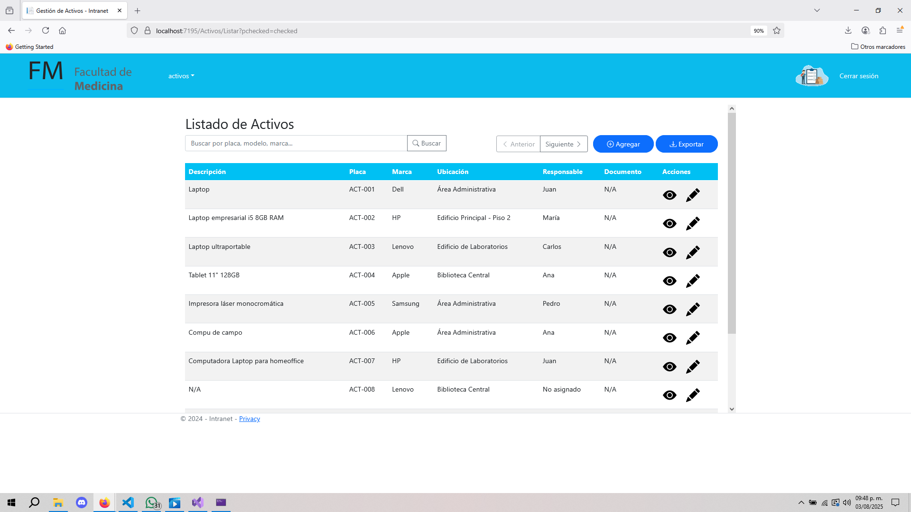
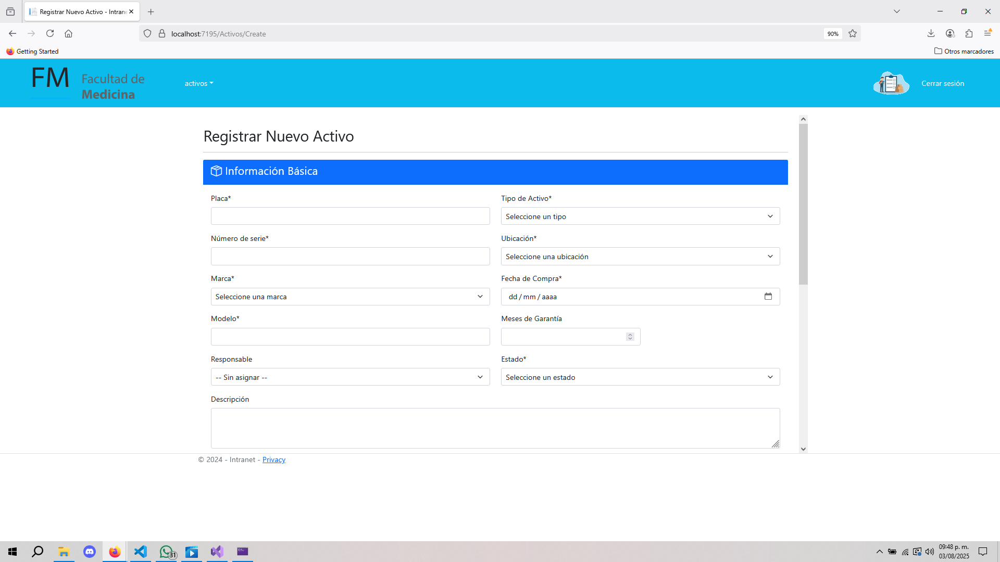
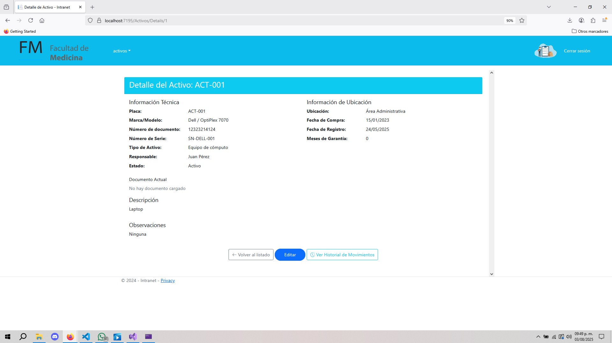
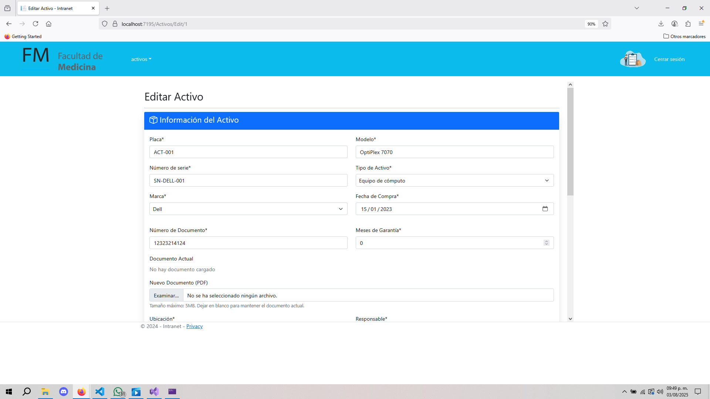
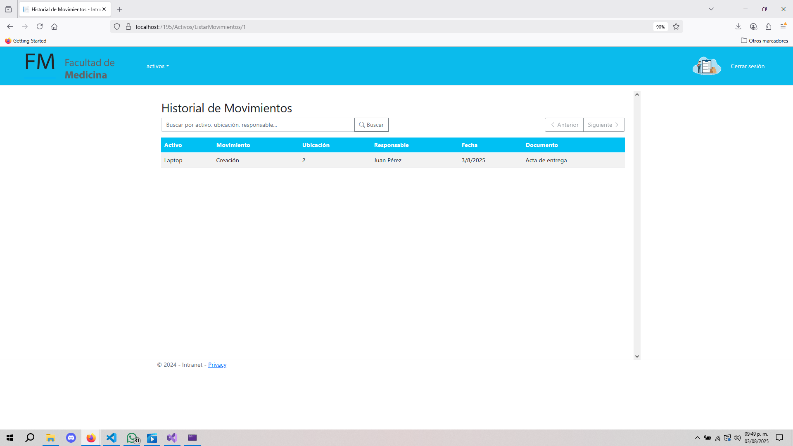

# Sistema de Gestión de Activos - Facultad de Medicina UCR

Este proyecto es una aplicación web desarrollada en **ASP.NET MVC** para la gestión de activos físicos dentro de la Facultad de Medicina de la Universidad de Costa Rica.

Permite llevar control de los activos por responsable, ubicación, estado y fecha de movimiento, así como la generación de reportes en **PDF** y **Excel** con opciones de filtrado y ordenamiento.

---

## 🧩 Características principales

- 🔍 **Listado dinámico de activos**
  - Filtrado por responsable, ubicación, estado y rango de fechas
  - Ordenamiento por descripción, placa, marca, ubicación o responsable

- 📥 **Exportación**
  - Exportación personalizada en formato **PDF** o **Excel**
  - Opciones seleccionables mediante modal interactivo

- 📁 **Gestión completa**
  - Creación, edición y registro de movimientos de activos
  - Detalles de ubicación, marca, estado y responsable de cada activo

- 📷 **Vista previa de reportes generados**
  - Se incluyen ejemplos visuales más abajo

---

## ⚙️ Tecnologías utilizadas

- ASP.NET MVC (.NET Framework)
- Razor Views
- LINQ para consultas dinámicas
- iTextSharp (PDF)
- ClosedXML (Excel)
- Bootstrap para diseño responsivo
- jQuery para manipulación dinámica de filtros y modal

---

## 🖼️ Imágenes de ejemplo

A continuación se muestran capturas de pantalla de la aplicación:

---

## 👤 Autor

Desarrollado por Bayron Alonso Ramírez Jiménez.
Estudiante de Ciencias de la Computación e Informática
Universidad de Costa Rica
📧 bayron.ramirezjimenez@ucr.ac.cr

---

